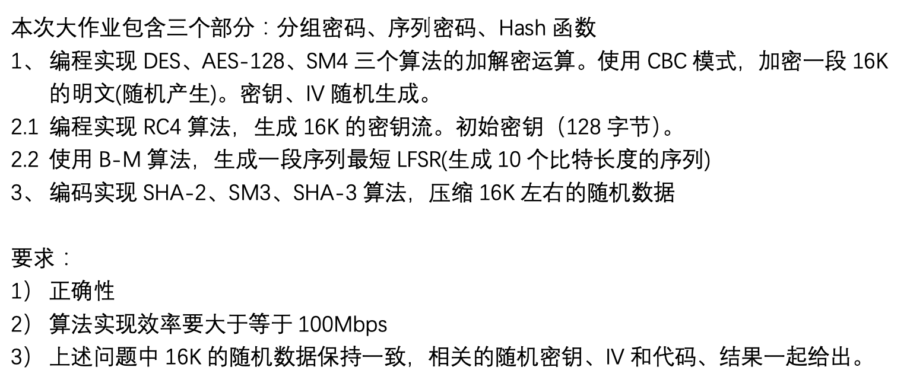

# Lab 2 Report

成镇宇 2017080068 计76

## 作业要求



## 作业结果

每题中的每一个算法都有自己的文件夹，只需要在他们各自的文件夹里运行下面的指令即可。

```bash
g++ encryptionAlgorithm.cpp
./a.out
```

结果如下：

```bash
DES Key: ABCDEFGH
DES IV: 0123456
DES ENCRYPT duration: 0.003414
DES ENCRYPT bandwidth: 4.57674Mbps
DES DECRYPT duration: 1.6e-05
DES DECRYPT bandwidth: 976.562Mbps
------------------------------------------------------
AES Key: abcdefghijklmnop
AES IV: 012345678910111
AES ENCRYPT duration: 0.001246
AES ENCRYPT bandwidth: 12.5401Mbps
AES DECRYPT duration: 0.000107
AES DECRYPT bandwidth: 146.028Mbps
------------------------------------------------------
SM4 Key: 11441089304702112721010275441457850878
SM4 IV: 168072824752491622650073984943658
SM4 ENCRYPT duration: 0.000103
SM4 ENCRYPT bandwidth: 151.699Mbps
SM4 DECRYPT duration: 9.9e-05
SM4 DECRYPT bandwidth: 157.828Mbps
------------------------------------------------------
RC4 plaintext: testing
RC4 key: thiskeyisjustsetfortestingandprobablyjustuseitbydefault
RC4 keystream is: 
332211771551241384184281242114825113917610888209189138161112552221589411319324623521062230381302461311322251521102542854184155143204187272938271361014624410516017316311491185811219221321891175117831133250245218651952161838220221548206202149108100181103198243425117244792559021223814851922191420723221719113619523164131124682001811311146737195817219212915819715017590175175154128128681351546190218146611171251164620515138221134834129107961521142521181951001901171032522201581591242252461029190344911210520786139183613847156717734461874521322618231181751523433423922118363201585914291137786124563271991367391203211027144371618319413225424022773226202648820811112794815076611339163228122211125251537122151511124020954104881361578723111235231114213247136213251211867193683794674456931271403824920110514525173165658112293193963312949899614714314012219620950432326116723816822381482148556245720024015518426586712361167229104250184206226239211515710117817136231107681268321418420657198119302252420011848126701861751501290196242224156178203248196815875207165781632482924325513471183132091701003921719413611923617121856524721319514031372317519621851227143841042192511712712252182269614231582498227301931797116220315913465829914486234312172077512972472532438474454020794438223989752541873220862264815633121791411121381516969149167221231
RC4 duration: 6.6e-05
RC4 bandwidth: 236.742Mbps
------------------------------------------------------
B-M Sequence is: 0001111100
B-M f_10(x) = 1 + x^2 + x^5
B-M l[10] = 5
B-M duration: 1.2e-05
B-M bandwidth: 1302.08Mbps
------------------------------------------------------
SHA-2 Digest: 64b2bf9511866423235146ba9caeadc3da48c802471e58e9aa106c5c59975b6
SHA-2 duration: 9.1e-05
SHA-2 bandwidth: 171.703Mbps
------------------------------------------------------
SHA-3 Digest: ea29d775a23c511a746050865b5f0797fa53cc9a49ab3d9f6780c0577ec54ecf
SHA-3 duration: 0.000278
SHA-3 bandwidth: 56.205Mbps
------------------------------------------------------
SM3 Digest: 1cf69642a8ccdbfaf41005e0dcc6273065bec0e64de30f262b024e4037e0c47a
SM3 duration: 0.000156
SM3 bandwidth: 100.16Mbps
```

其中16k的明文data来自`/Data/plaintext.txt`。